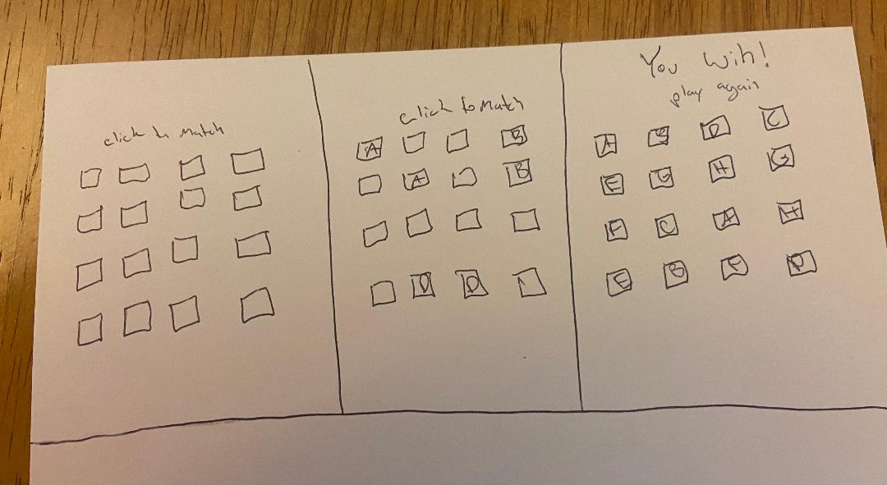

# Memory Card Game

This will be a basic memory card game. There will be even numbers of cards to match letters A-H.

## Instructions

Click on each card to flip. If two card are matched they will stay face up. If two cards are clicked that do not match, they will turn face down again. Once all cards are matched and face up, the board will reset and mix with an additional set of cards to match. 

## Pictures

## Pseudo Code

- Create a blank board
- Create blank squares for each card to fill
- Create random card generator 1-100 that will generate in pairs
- Create random generator for placing cards
- Function to flip cards on click
- Function to flip cards back upside down
- Function to keep cards face up upon match
- Function to end game once cards are all face up and display win message
- Play again function

## Technologies Used

- HTML
- CSS 
- JavaScript
- VSCode

## Getting Started

Click the link below to start the game. Click on cards to match. 10 incorrect matches dictates a loss.

https://followthefelix.github.io/Proj1-CardMatch/ 

## Next Steps

I would like to create a visual animation for the cards flipping over, instead of just showing the letters. I would also like to create levels, where after each 'win', more cards are added to the board.
